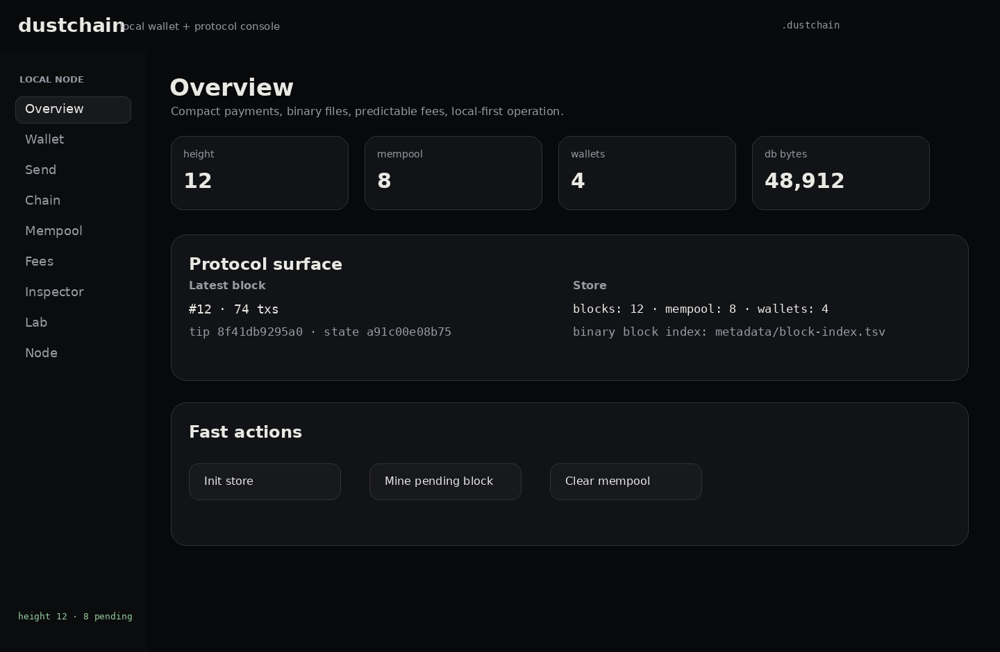
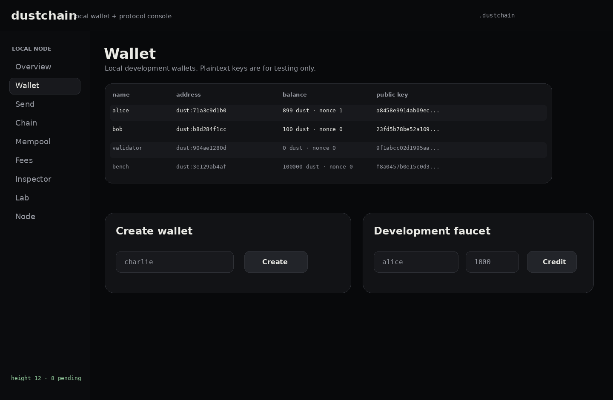
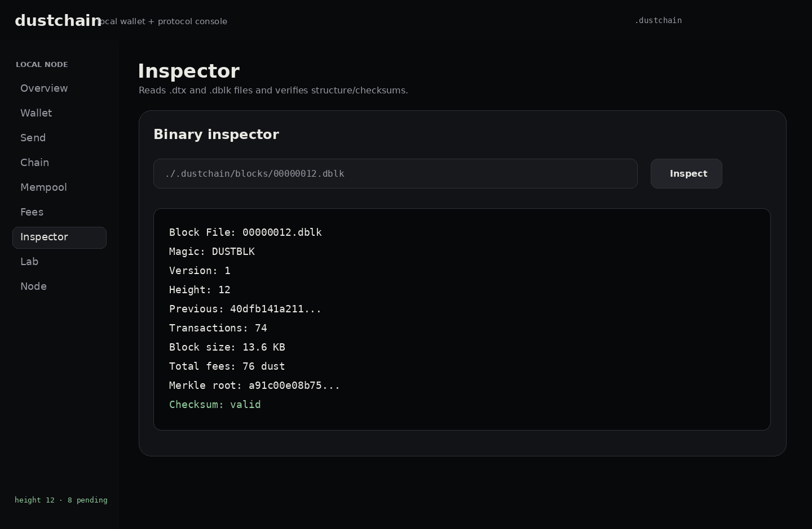
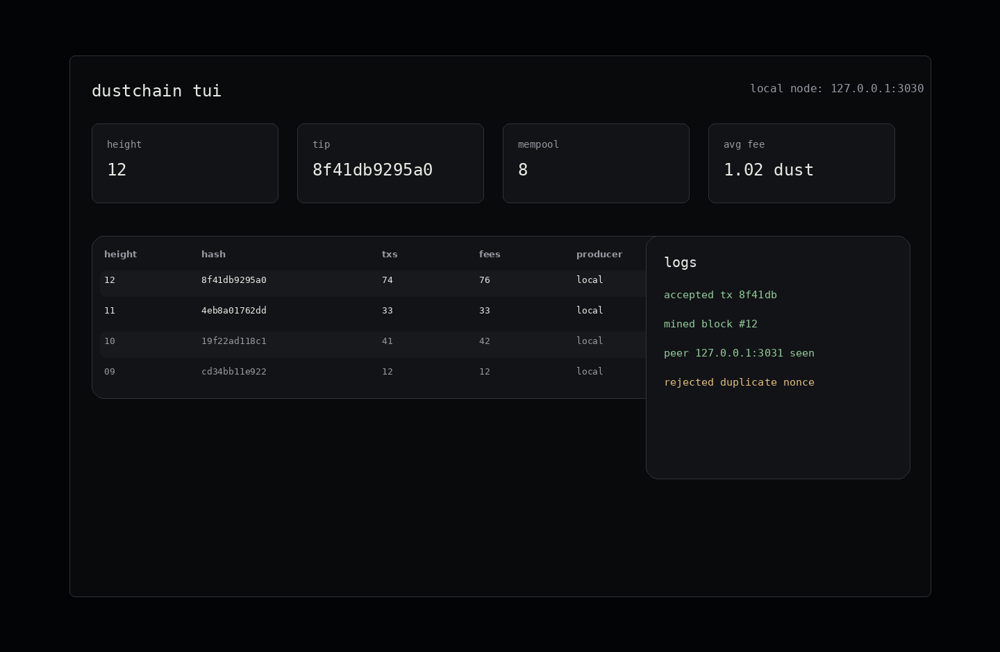

# dustchain

Low fees. Compact blocks. Terminal-first. Local GUI optional.

`dustchain` is an experimental low-fee blockchain implementation in Rust. It focuses on compact binary transactions, predictable micro-fees, local P2P nodes, benchmark tooling, terminal inspection, a native desktop wallet console, and safe local adversarial simulations.

It is **not** a production cryptocurrency, investment product, token launch, or smart-contract platform. It is a protocol-engineering portfolio project.



## Why

Low fees do not come from pretending mining is cheap. They come from protocol discipline:

- compact transaction encoding;
- deterministic fee rules;
- bounded memo and transaction sizes;
- blockspace limits;
- nonce-based replay protection;
- mempool caps and fee-per-byte ordering;
- binary block files that can be inspected;
- measured cost per transaction.

The core fee rule is intentionally simple:

```text
fee = base_fee + size_fee + optional_priority_fee
```

Default local policy:

```text
base_fee = 1 dust
fee_per_kb = 1 dust
minimum transfer fee = 1 dust
```

## Features

| Area | Status |
|---|---|
| Account model | balances + nonces |
| Wallets | local Ed25519-style key material |
| Transactions | signed compact transfers |
| Fees | base fee + size fee + priority fee |
| Blocks | local block production and verification |
| Binary formats | `.dtx` and `.dblk` with magic bytes/checksum |
| Storage | file-backed persistent local chain store |
| Mempool | bounded pending transaction files |
| Localnet | loopback TCP node/control messages |
| TUI | terminal dashboard snapshot |
| GUI | native desktop wallet/protocol console |
| Benchmarks | Criterion scaffolding and CLI report command |
| Lab | local-only spam/replay/invalid-input simulations |

## Quick start

```bash
cargo run -p dust-cli -- init
cargo run -p dust-cli -- wallet new alice
cargo run -p dust-cli -- wallet new bob
cargo run -p dust-cli -- faucet alice 1000
cargo run -p dust-cli -- tx send alice bob 100
cargo run -p dust-cli -- mine
cargo run -p dust-cli -- balance alice
cargo run -p dust-cli -- balance bob
cargo run -p dust-cli -- chain verify
```

Expected local outcome:

```text
alice balance: 899 dust
bob balance: 100 dust
fee paid: 1 dust
chain status: valid
```

## Native GUI

The GUI is a local wallet and protocol console in the same spirit as classic desktop wallet clients: left navigation, wallet table, send form, chain view, mempool view, fee estimator, binary inspector, lab runner, and localnet notes. It uses the same `.dustchain` store as the CLI.

```bash
cargo run -p dust-gui
# or
cargo run -p dust-cli -- gui
```





The screenshots in `assets/screenshots/` are static showcase captures for the repository. Re-capture them from the running GUI before a public release if the UI changes.

## CLI surface

```bash
dust init
dust wallet new alice
dust wallet list
dust wallet show alice
dust faucet alice 1000
dust tx send alice bob 100 --priority-fee 0
dust mine
dust chain height
dust chain verify
dust chain inspect 1
dust chain db-stats --verbose
dust chain reindex
dust chain export-state
dust balance alice
dust mempool list
dust mempool clear
dust fee estimate --amount 100 --memo hello
dust inspect tx ./.dustchain/mempool/<hash>.dtx
dust inspect block ./.dustchain/blocks/00000001.dblk
dust node start --port 3030
dust peer add 127.0.0.1:3031
dust peer probe 127.0.0.1:3031
dust tui
dust gui
dust lab spam --txs 50000
```

## Binary formats

Transaction files use `.dtx` and block files use `.dblk`.

```text
DUSTTX  version  payload_length  payload  signature  checksum
DUSTBLK version  header_length   body_length header transactions checksum
```

Inspector example:

```bash
dust inspect block ./.dustchain/blocks/00000001.dblk
```

```text
Block File: 00000001.dblk
Magic: DUSTBLK
Version: 1
Height: 1
Transactions: 2
Checksum: valid
```

## Terminal UI

```bash
dust tui
```



The TUI focuses on chain height, latest block, mempool size, fee policy, peers, logs, and store size.

## Benchmarks

The repo includes Criterion benchmark targets and CLI benchmark commands:

```bash
dust bench
cargo bench
```

No fake benchmark numbers are committed. Generate local results on your machine, then update `BENCHMARKS.md` / `docs/benchmarks.md` with the real output.

## Local adversarial lab

The lab is local-only. It tests the implementation, not third-party systems.

```bash
dust lab spam --txs 50000
dust lab replay
dust lab invalid-tx
dust lab invalid-block
dust lab oversized-block
dust lab fork
```

Example report shape:

```text
scenario: spam
generated_txs: 50000
accepted: 2000
rejected_underpriced: ...
node_status: healthy
panic: false
```

## Architecture

```text
crates/dust-core     account/state/tx/block/fees/validation
crates/dust-crypto   key generation, addresses, signatures
crates/dust-wire     custom binary encoder/decoder/framing
crates/dust-store    persistent file-backed node store
crates/dust-mempool  mempool policy and priority ordering
crates/dust-node     local TCP node, peer probing, block fetch
crates/dust-tui      terminal dashboard snapshot
crates/dust-gui      native desktop wallet/protocol console
crates/dust-lab      local adversarial simulations
crates/dust-cli      `dust` command-line interface
```

## Validation

Run before tagging:

```bash
cargo fmt --all
cargo check --workspace
cargo test --workspace
cargo clippy --workspace --all-targets -- -D warnings
cargo bench
```

## Security

`dustchain` is experimental. It is not audited. It is not production-ready. Wallet files are local plaintext development material. Do not use it for real funds or public financial activity.

## License

MIT.
